# STANAG Web Viewer User Guide

## 1. Overview

The STANAG Web Viewer provides a browser-based view of connected unmanned vehicles and their current operational state.

The interface can be used to:

- View connected vehicles and live telemetry.
- Inspect vehicle health, navigation state, capabilities, and raw twin data.
- View current and scheduled STANAG tasks.
- Create supported STANAG tasks.
- Cancel active or scheduled tasks.
- Resend an active task to a vehicle when recovery is required, such as after an autopilot reset.
- View detections and operational areas on the map.
- Review application and task events.

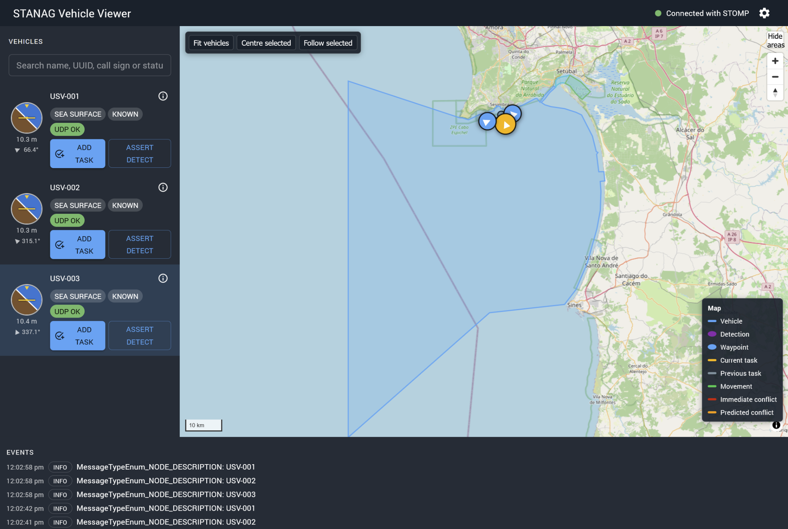

*Main application view showing connected vehicles, the operational map, and the event log.*

---

## 2. Connecting to the Server

Connection settings are available from the settings control at the top of the application.

The settings define:

- Messaging transport.
- Broker address.
- REST API address.
- Username and password.
- Drone topic.
- Task status and administration topics.
- STANAG source identifier.
- STANAG version.

After applying the settings, the viewer connects to the messaging server and loads the currently active and future STANAG tasks using the REST API.

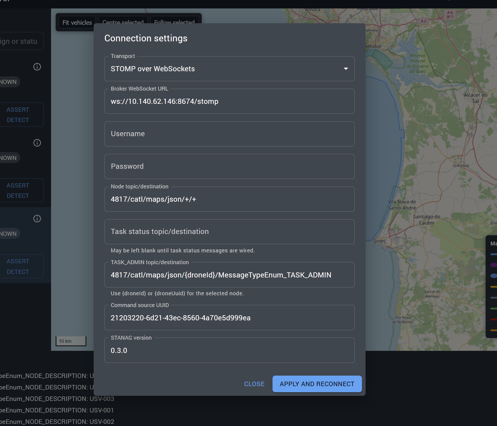

*Connection settings for the messaging transport, topics, command source, and STANAG version.*

---

## 3. Vehicle List

The vehicle list shows all vehicles currently known to the viewer.

Each vehicle entry includes:

- Vehicle name.
- Latest human-readable MAVLink status text, when available.
- Live/stale state.
- MAVLink UDP stream state.
- Current task and progress, when applicable.
- Controls for creating or cancelling tasks.
- A control for opening detailed vehicle information.

The latest MAVLink `STATUSTEXT` message is shown directly below the vehicle name. This provides useful operator-oriented messages from the autopilot, such as pre-arm warnings, navigation messages, estimator warnings, or mission-related information.

Long messages are shortened in the list. Hover over the text to see the complete message.

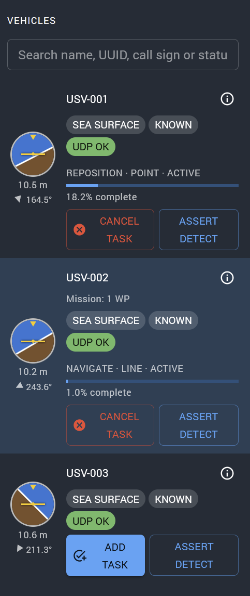

*Vehicle list showing live MAVLink status text, connection state, task state, and task progress.*

### Searching Vehicles

The search field can match:

- Vehicle name.
- UUID.
- Call sign.
- MAVLink status text.

This can be useful when locating a vehicle reporting a particular warning or state.

---

## 4. Vehicle Details

Select the information control on a vehicle to open the Vehicle Details dialog.

The dialog contains several tabs.

### 4.1 General

The General tab shows identity and operational information including:

- UUID.
- Twin identifier.
- Display name.
- Call sign.
- Model.
- Vehicle class.
- MAVLink system and component IDs.
- Organisation and nationality.
- Autopilot type.
- Flight mode.
- Mission state.
- Lifecycle state.
- Readiness state.
- Command readiness.
- Last update times.

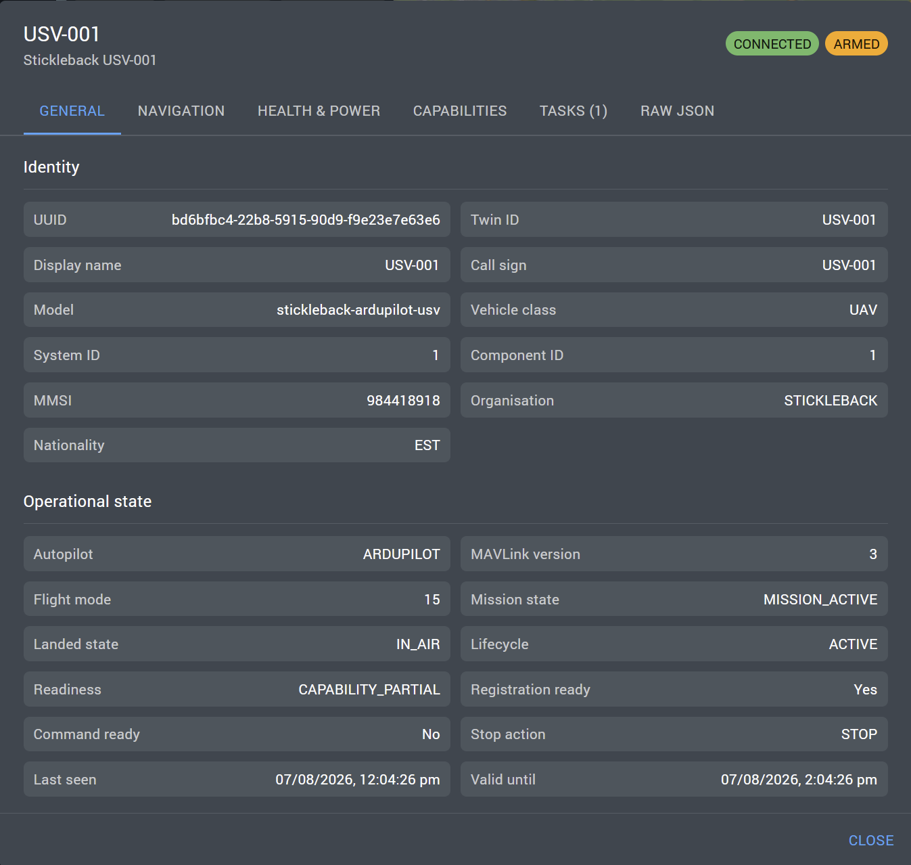

*General vehicle identity and operational state.*

### 4.2 Navigation

The Navigation tab shows:

- Vehicle attitude.
- Heading and course.
- Latitude and longitude.
- Altitude.
- Ground speed.
- Vertical speed.
- Velocity vector.
- Home position.
- GPS fix type.
- Satellite count.
- HDOP and VDOP.

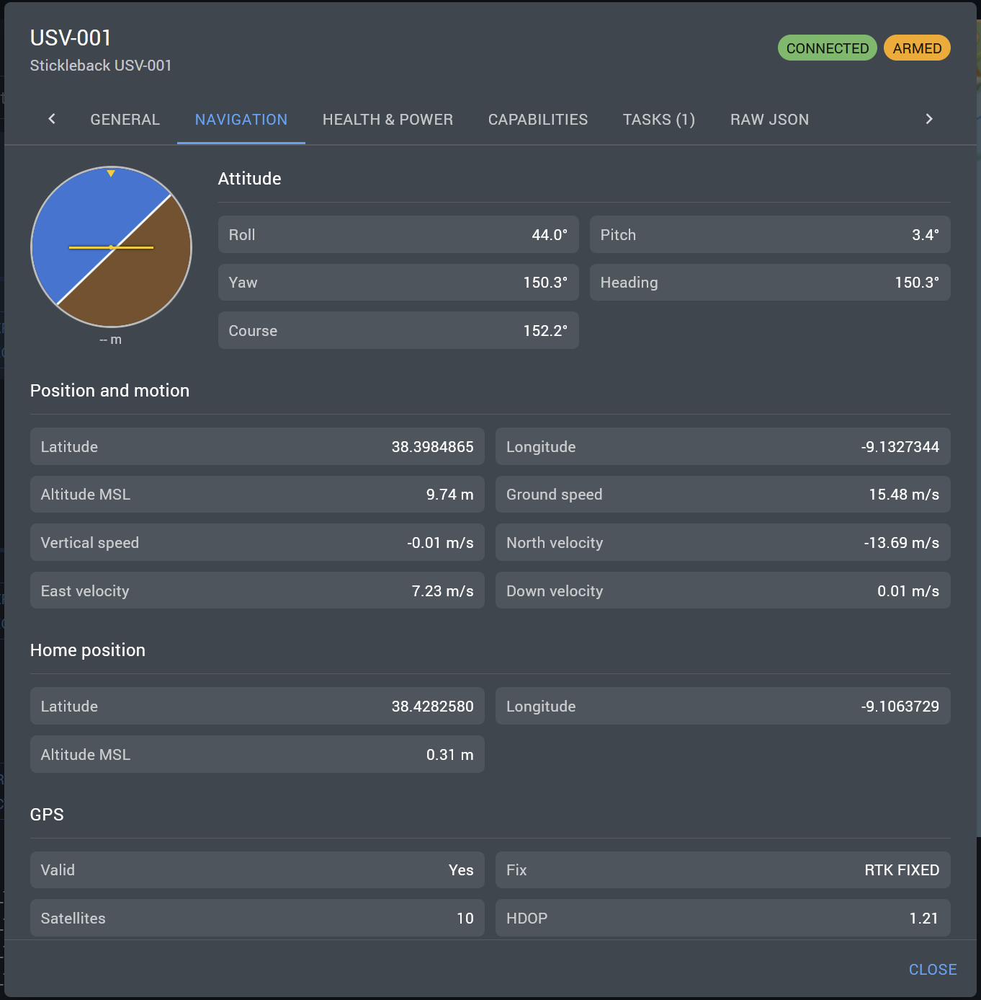

*Navigation, position, motion, home position, and GPS information.*

### 4.3 Health & Power

The Health & Power tab shows:

- MAVLink stream health.
- System health.
- CPU load.
- Link state.
- Battery percentage.
- Battery voltage.
- Battery current.
- Remaining battery duration.
- Readiness information.

System health is derived from MAVLink `SYS_STATUS`. A vehicle is considered healthy when all currently enabled MAVLink sensors report healthy.

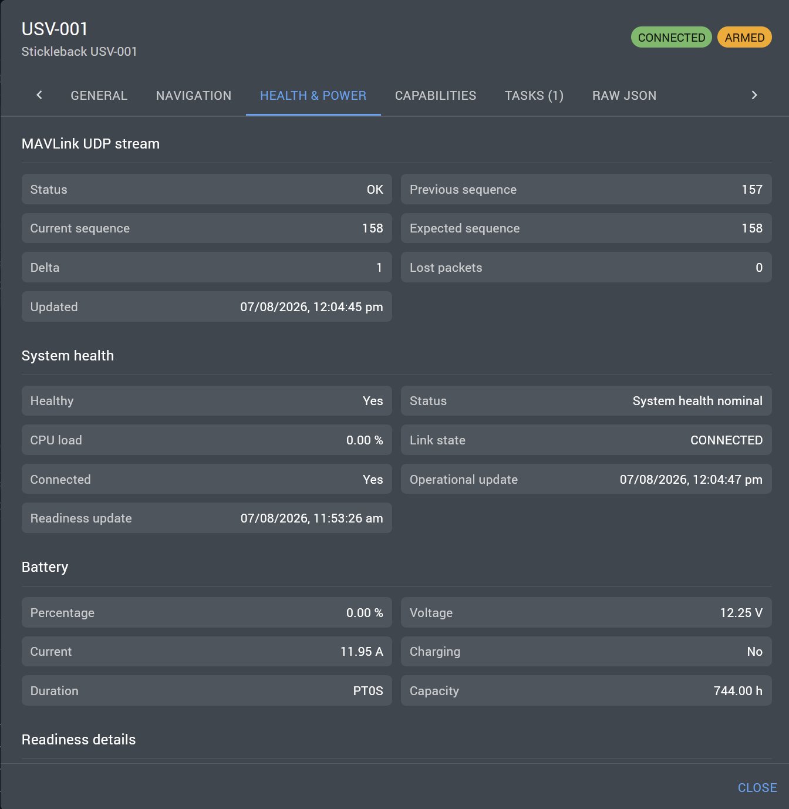

*Health & Power view showing MAVLink stream status, nominal system health, and battery information.*

### 4.4 Capabilities

The Capabilities tab lists the STANAG task types supported by the selected vehicle.

Capabilities depend on the vehicle model and server configuration.

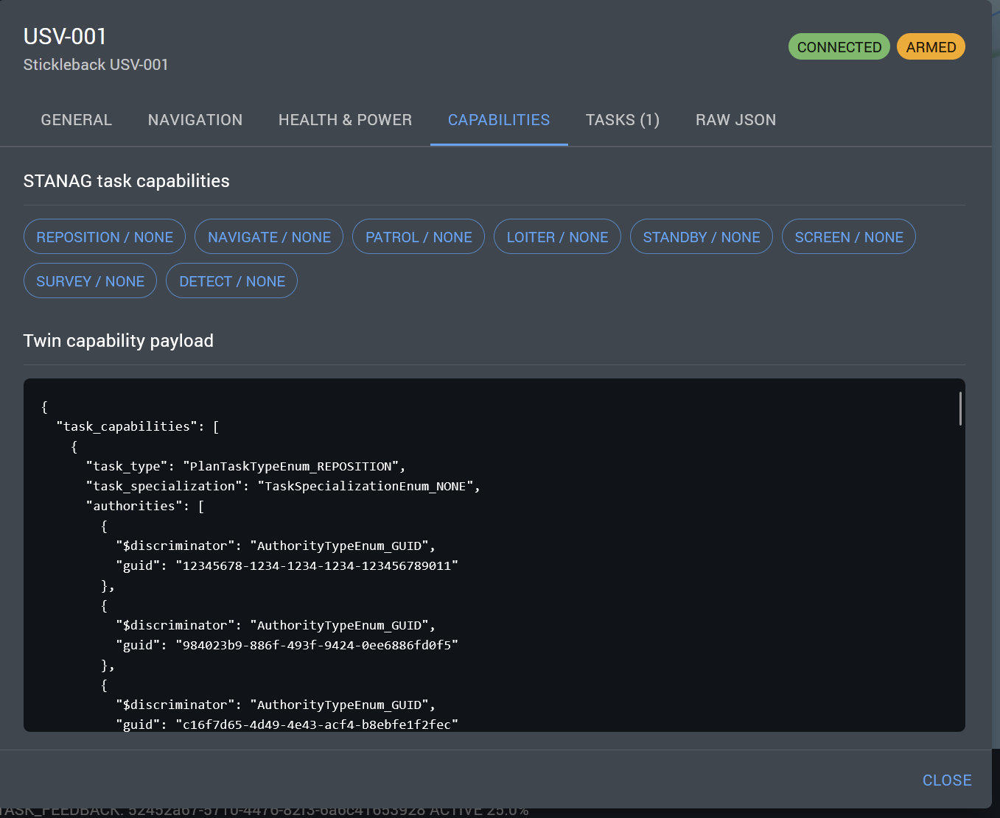

*Supported STANAG task capabilities for the selected vehicle.*

### 4.5 Raw JSON

The Raw JSON tab displays the complete current vehicle twin.

Use **Copy JSON** to copy the payload for diagnostics or support.

A twin can include information such as:

- MAVLink state.
- Position and motion.
- Battery state.
- System health.
- Vehicle readiness.
- Task capabilities.
- Latest vehicle status text.

No screenshot is essential for this section unless the guide is intended for technical users.

---

## 5. Tasks

The Tasks tab in Vehicle Details lists the active and future tasks associated with the selected vehicle.

For each task the viewer shows:

- Task type.
- Current state.
- Task name and description.
- Task identifier.
- Geometry.
- Start and end times.
- Duration.
- Completion percentage.

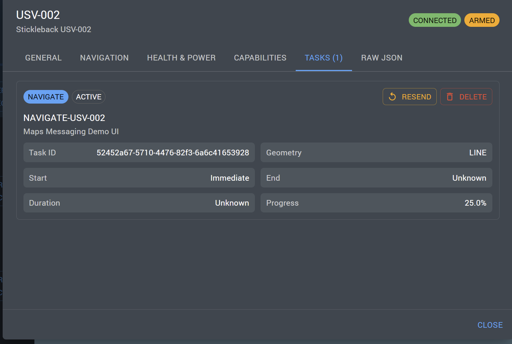

*Active task view showing task type, geometry, progress, and operator controls.*

---

## 6. Creating a Task

Use **Add task** for a vehicle that advertises task capabilities.

The task editor allows the operator to select a supported task type and define the task-specific geometry and settings.

Depending on the task type, this can include:

- A point.
- A line or route.
- A circle.
- A polygon.
- A corridor.
- Start and end times.
- Duration.

Only task types supported by the selected vehicle are available.

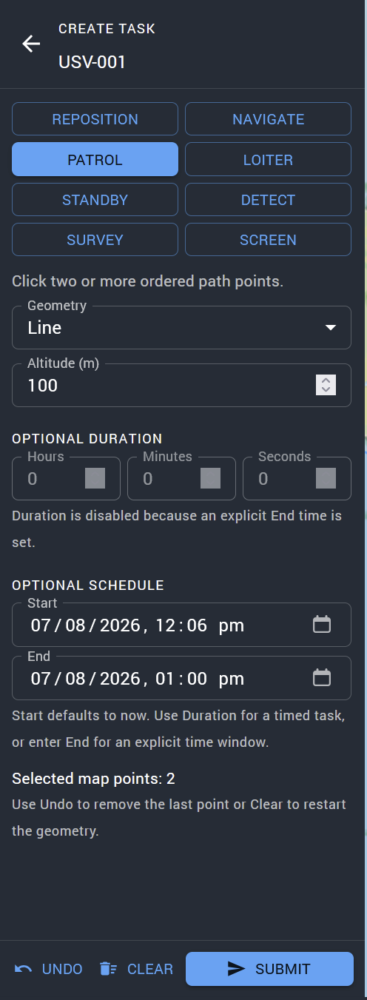

*Task editor configured for a patrol route with schedule and geometry controls.*

If the task includes map interaction, also capture the selected route or geometry:

> **Optional screenshot: `10-task-map-geometry.png`**  
> Capture the map with the task geometry clearly visible.

---

## 7. Cancelling a Task

An active or scheduled task can be cancelled using the task controls.

Cancellation requests the server to stop the current task using the configured completion action for that vehicle.

Depending on vehicle configuration, the stop action may result in behaviour such as:

- Hold position.
- Stop.
- Loiter.
- Return to home.

The task state changes while the cancellation is being processed and is removed from the active task list once terminal.

---

## 8. Resending an Active Task

An active task can be resent to the vehicle using **Resend**.

This is intended as a recovery operation, for example when:

- The autopilot has restarted.
- The vehicle has lost its uploaded mission.
- The server still considers the task active but the vehicle is no longer executing it.

### Important

Resend does **not** send only the current waypoint or current leg.

It sends the **entire translated MAVLink task plan from the beginning**.

For navigation-based tasks, the vehicle may therefore restart execution from the first waypoint.

The viewer always displays a confirmation warning before allowing the resend request.

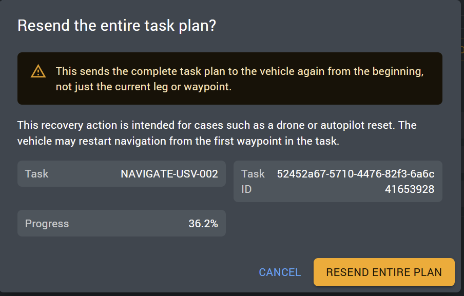

*Confirmation shown before resending the complete task plan from the beginning.*

Use resend only when the operator understands the effect of restarting the complete task plan.

---

## 9. Map

The map displays vehicle locations and operational information.

Depending on the configured data, it may also display:

- Current vehicle position.
- Vehicle history.
- Task waypoints or shapes.
- Operational areas.
- Detection locations.

The map is intended to provide geographic context rather than replace the vehicle's primary ground-control system.

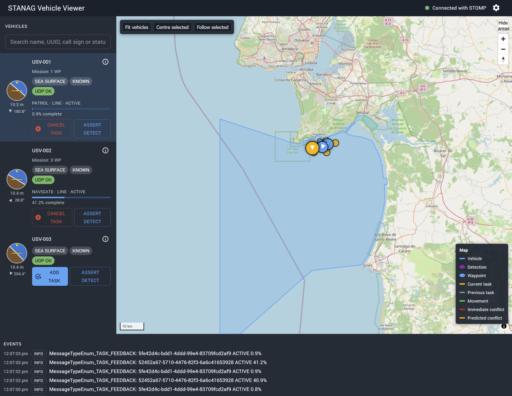

*Operational map showing multiple vehicles, the operating area, and current task activity.*

---

## 10. Detections

When detection information is received, detected objects are added to the map and application state.

Detection information may include:

- Position.
- Classification or name.
- Source vehicle.
- Related data products.
- Video or RTSP information where available.

If detection operation is part of the demonstration workflow:

> **Optional screenshot: `13-detection.png`**  
> Capture a visible detection on the map and any corresponding vehicle or event information.

---

## 11. Event Log

The event log records significant application events including:

- Connections.
- Task submissions.
- Task state changes.
- Task cancellations.
- Task resend requests.
- Detection events.
- REST failures.
- Messaging or parsing errors.

The event log is useful when confirming whether an operator action was accepted by the UI and sent to the server.

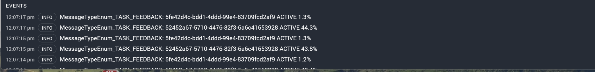

*Event log showing live task feedback and progress updates.*

---

## 12. Operational Notes

### STANAG Task State vs Vehicle State

The viewer tracks the STANAG task lifecycle separately from the vehicle's own MAVLink state.

An active STANAG task means that the server considers the task active. It does not necessarily guarantee that the autopilot still has the mission loaded. This distinction is why the resend operation exists.

### Vehicle Human-Readable Status

The latest MAVLink `STATUSTEXT` value provides the most recent human-readable message emitted by the autopilot.

It should be treated as a diagnostic message rather than a formal persistent state. The message may describe a transient event such as:

- Mission accepted.
- Waypoint reached.
- Pre-arm failure.
- GPS warning.
- EKF warning.
- Mode transition.

### System Health

System health is computed from MAVLink `SYS_STATUS` sensor masks.

A system is considered healthy when every enabled sensor reports a healthy state. Disabled sensors do not cause the vehicle to be marked unhealthy.

Readiness is separate from system health. A vehicle can be healthy while still being unable to accept commands because required identity, capability, or configuration information is missing.

---

## 13. Included Screenshots

The screenshots in this guide were captured from the demonstration environment and are arranged in the same sequence as the user workflow described above.

Two additional screenshots remain optional for a later revision:

- Task geometry shown clearly on the map while editing a task.
- A detection example showing the detected object and related event information.

